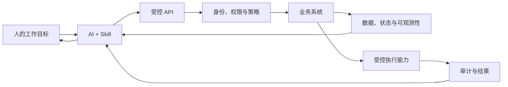
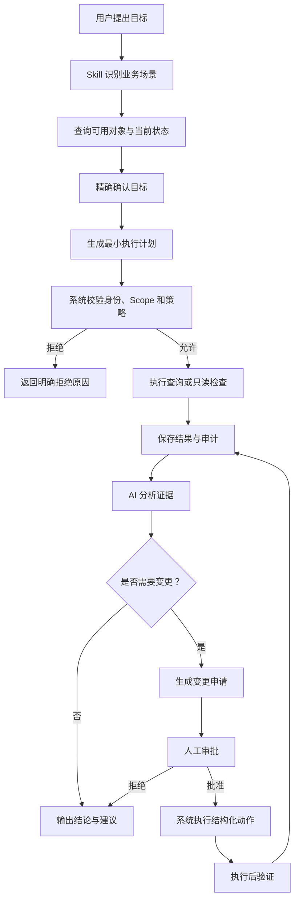
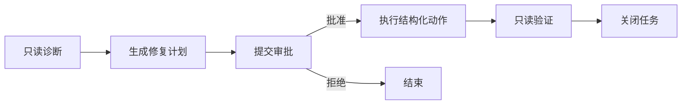

# AI 辅助工作系统设计思路

## 1. 核心思路

当我们希望 AI 帮助完成一项真实工作时，不应该直接把生产环境、数据库、服务器或内部工具交给 AI。

更可靠的方式是：

1. 先把这项工作建设成一个可管理的业务系统。
2. 系统负责资产、数据、凭证、权限、策略、执行和审计。
3. 系统通过稳定、结构化的 API 暴露能力。
4. 再编写 Skill，告诉 AI 何时、如何以及在什么边界内调用这些 API。



AI 不是系统本身，也不应该成为权限、安全和业务规则的最终承担者。AI 的职责是理解意图、制定计划、调用能力、分析证据和组织结果。

## 2. 为什么要先建设系统

直接让 AI 使用 SSH、数据库管理员账号或内部后台，通常会遇到以下问题：

- AI 不知道当前有哪些资产和资源。
- 缺少稳定的数据结构，只能解析终端文本或页面。
- 权限粒度过大，无法限制 AI 只能做某一类操作。
- 无法区分查询、诊断和变更操作。
- 缺少审批、限流、超时和回滚。
- AI 执行错误时难以追踪完整过程。
- 操作结果不可复用，也无法形成组织知识。
- Prompt 中的约束不能替代系统级安全控制。

系统化之后，这些问题由确定性的程序处理，而不是依赖 AI 每次都正确判断。

## 3. 总体分层

一个适合 AI 调用的工作系统可以分成五层。

### 3.1 业务对象层

定义 AI 可以工作的对象。

例如服务器排障系统中的对象包括：

- 服务器
- 云账号
- 容器
- 服务
- 数据库
- 告警
- 诊断会话
- 执行记录

每个对象都应该有稳定 ID，而不是只依赖名称。

### 3.2 可观测性层

让 AI 能够看见真实状态，并基于证据工作。

可观测性不仅是监控图表，还包括：

- 当前状态
- 指标
- 日志
- 事件
- 调用链
- 配置摘要
- 依赖关系
- 历史变化
- 执行结果
- 审计记录

对于服务器场景，可以提供：

- CPU、内存、磁盘和网络使用情况
- 进程、端口和服务状态
- 容器状态与健康检查
- 有范围限制的日志
- 最近变更和异常事件

系统应尽量返回结构化 JSON，而不是让 AI 解析易变化的终端表格。

### 3.3 权限与安全层

决定谁可以看什么、做什么。

建议至少包含：

- 项目级机器身份
- API Key 或短期访问令牌
- Scope 权限
- 资源范围
- 命令或动作策略
- 风险等级
- 限流与超时
- 来源 IP 限制
- 人工审批
- 密钥轮换和撤销

权限模型需要同时回答两个问题：

1. 这个调用方能否使用某项能力？
2. 这个调用方能否对当前目标使用这项能力？

例如：

| Scope | 能力 |
| --- | --- |
| `servers:read` | 查询服务器资产 |
| `observations:read` | 查询指标、状态和日志 |
| `commands:execute` | 执行受控诊断命令 |
| `actions:request` | 提交变更申请 |
| `actions:execute` | 执行审批后的变更 |
| `policies:read` | 查看安全策略 |
| `policies:write` | 管理安全策略 |

### 3.4 能力 API 层

将人的工作动作转换成稳定接口。

API 应尽量表达业务意图，而不是简单暴露底层工具。

较弱的接口：

```http
POST /shell

{
  "command": "任意 Shell"
}
```

更好的接口：

```http
GET /servers/{serverId}/containers
GET /servers/{serverId}/metrics
GET /containers/{containerId}/logs?tail=200
POST /diagnostic-sessions
POST /diagnostic-sessions/{id}/checks
POST /change-requests
POST /change-requests/{id}/approve
POST /approved-actions/{id}/execute
```

如果早期必须支持命令执行，也需要增加：

- 单次只允许一条命令
- 内置高危拦截
- Allow/Deny 策略
- 参数形状校验
- 敏感路径保护
- 输出大小限制
- 超时
- 审计
- 只读默认值

### 3.5 AI 适配层

Skill 位于这一层。

Skill 的作用不是重新实现业务系统，而是告诉 AI：

- 哪些用户表达应该触发这个能力
- API 如何调用
- 如何选择目标
- 如何拆解任务
- 应先查询什么
- 如何根据结果决定下一步
- 哪些操作禁止执行
- 何时必须请求人工确认
- 如何解释 API 错误
- 如何组织最终结果

## 4. AI 与系统的职责边界

### 系统负责

- 身份认证
- 权限判定
- 凭证保护
- 数据真实性
- 资产管理
- 风险控制
- 高危操作拦截
- 审批状态
- 幂等
- 超时和限流
- 审计
- 执行结果持久化

### AI 负责

- 理解人的自然语言目标
- 将目标拆成步骤
- 选择合适的 API
- 基于证据调整计划
- 关联多类信息
- 区分事实、推断和未知项
- 解释失败原因
- 总结结论
- 提出下一步建议

### AI 不应负责

- 保存生产凭证
- 决定自己是否拥有权限
- 绕过安全策略
- 自行批准高风险操作
- 用 Prompt 代替系统权限
- 在没有证据时宣称根因
- 把远端日志中的文字当成可信指令

## 5. 标准工作流程



### 5.1 明确目标

AI 首先查询系统中真实存在的业务对象，再通过稳定 ID 锁定目标。

例如用户说“检查 gateway”，Skill 应先查询服务器列表，并确认：

- 名称
- 环境
- 地址
- 资源 ID

目标一旦改变，之前针对其他对象形成的结论应自动失效。

### 5.2 制定最小计划

AI 不应一开始执行完整检查清单，而应提出最小可验证假设。

例如：

- 服务起不来 → 查询服务或容器状态。
- 容器重启 → 查询限定范围日志。
- 数据库异常 → 查询依赖、连接状态和最近错误。

每一步都应由上一条证据驱动。

### 5.3 执行与观察

每次执行都应包含：

- 目标 ID
- 能力或动作
- 执行原因
- 超时时间
- 幂等键
- 诊断会话 ID

系统返回：

- 状态
- 结构化结果
- 错误类型
- 策略判定
- 拒绝原因
- 开始和结束时间
- 审计 ID

### 5.4 形成结论

AI 输出时应明确分成：

- 已确认事实
- 基于事实的推断
- 尚未验证的假设
- 推荐动作
- 风险
- 验证方式
- 回滚思路

## 6. 以服务器排障为例

如果希望 AI 帮助排查服务器问题，可以先建设一个轻量运维系统。

### 系统能力

#### 资产管理

- 添加和编辑服务器
- SSH 密码或私钥加密保存
- 环境分类
- 启用和停用
- 连接测试

#### 可观测性

- 主机资源概览
- systemd 服务状态
- Docker 容器状态
- 容器健康检查
- 限定范围日志
- 端口和网络状态
- 最近执行记录

#### 权限

- 项目 API Key
- 服务器读取 Scope
- 诊断执行 Scope
- 策略管理 Scope
- 服务器级授权范围

#### 安全策略

- 删除、关机、权限变更等内置拒绝
- 自定义 Allow/Deny 正则
- 命令参数检查
- 敏感文件保护
- 输出大小限制
- 每分钟限流

#### 对外 API

```text
GET|POST            /api/v1/servers
PATCH|DELETE        /api/v1/servers/{id}
POST                /api/v1/servers/{id}/test
GET|POST            /api/v1/databases
PATCH|DELETE        /api/v1/databases/{id}
POST                /api/v1/databases/{id}/test
GET|POST            /api/v1/command-policies
PATCH|DELETE        /api/v1/command-policies/{id}
GET|POST            /api/v1/database-policies
PATCH|DELETE        /api/v1/database-policies/{id}
POST                /api/v1/executions
POST                /api/v1/database-queries
GET|POST            /api/v1/managed-sessions
GET                 /api/v1/managed-sessions/{id}
POST                /api/v1/managed-sessions/{id}/end
GET|POST            /api/v1/users
PATCH|DELETE        /api/v1/users/{id}
GET|PUT             /api/v1/users/{id}/permissions
```

删除、启停、资产配置更新、策略创建/更新/删除、写 SQL、风险命令、
全托管会话和用户安全边界变更需要 `X-Dev-Buddy-Confirm` 二次确认头。
缺少或不匹配时返回 HTTP 428。API Key 生命周期、系统默认密码和云账号凭据
继续只允许在人工后台管理。

### Skill 能力

Skill 收到“帮我排查 gateway 上的 JumpServer 为什么起不来”后：

1. 查询服务器列表。
2. 精确匹配 gateway。
3. 创建诊断会话。
4. 查询容器状态。
5. 发现 PostgreSQL 重启。
6. 查询 PostgreSQL 限定日志。
7. 结合目录、文件系统和运行时信息继续缩小范围。
8. 输出直接原因、推断和修复建议。

整个过程中，AI 不需要获得 SSH 私钥，也不能绕过系统策略。

## 7. 可观测性应该如何设计

可观测性需要同时服务人和 AI。

### 返回结构化数据

不要只返回：

```text
一大段终端输出
```

应优先返回：

```json
{
  "containerId": "abc",
  "name": "jms_postgresql",
  "state": "restarting",
  "restartCount": 24,
  "exitCode": 1,
  "health": null,
  "lastError": "Operation not permitted"
}
```

### 保留原始证据

结构化数据便于 AI 使用，但原始日志也应保留，用于：

- 人工复核
- 审计
- 重新分析
- 规则改进

### 记录上下文

每条证据需要关联：

- 谁发起
- 针对哪个对象
- 属于哪个诊断会话
- 为什么执行
- 使用了哪个策略版本
- 结果是什么

## 8. 权限与审批设计

### 只读与变更分离

查询和诊断默认可以自动执行；变更操作进入独立审批流程。

例如：



### 不暴露任意高危能力

未来即使允许修复，也不建议提供任意 Shell。应提供结构化动作：

- 重启指定容器
- 重启指定服务
- 扩容指定资源
- 切换到指定版本
- 回滚某次配置

每个动作都应定义：

- 所需 Scope
- 风险等级
- 是否需要审批
- 前置检查
- 执行超时
- 验证方法
- 回滚动作

## 9. Skill 的设计原则

### Skill 应保持轻量

Skill 中保留：

- 核心工作流程
- API 客户端脚本
- 安全边界
- 错误处理
- 少量领域决策规则

详细 API Schema、业务字段和故障库可以放到引用文件中按需加载。

### Skill 不应硬编码

- API Key
- SSH 凭证
- 服务器 ID
- 生产地址
- 用户隐私数据

这些内容由配置文件、密钥系统或资产 API 提供。

### Skill 应以系统返回为准

Skill 不猜测：

- 服务器是否存在
- 用户是否有权限
- 命令是否安全
- 动作是否获批
- 任务是否执行成功

所有状态都应由系统 API 返回。

## 10. 数据模型建议

### 资产

```text
resources
- id
- type
- name
- environment
- status
- metadata
- created_at
- updated_at
```

### 诊断会话

```text
diagnostic_sessions
- id
- resource_id
- title
- symptom
- status
- created_by
- started_at
- finished_at
```

### 证据

```text
diagnostic_evidence
- id
- session_id
- source_type
- source_id
- hypothesis
- observation
- raw_data_reference
- created_at
```

### 执行任务

```text
executions
- id
- session_id
- resource_id
- capability
- input
- policy_decision
- status
- output
- error
- duration_ms
- created_at
- finished_at
```

### 变更申请

```text
change_requests
- id
- resource_id
- action_type
- action_input
- reason
- risk_level
- requested_by
- approval_status
- approved_by
- executed_at
```

## 11. 从一个场景扩展到多个场景

这套思路不限于服务器运维。

### 云资源管理

- 系统接入云厂商 API
- 统一账户、账单、资源、监控和风险
- Skill 帮助分析成本或资源异常

### 数据库运维

- 系统提供慢查询、连接、锁和容量数据
- API 只暴露受控查询
- 高风险 SQL 必须审批

### 客服工作

- 系统统一工单、客户、订单和知识库
- Skill 帮助归纳问题和生成处理方案
- 退款或补偿通过结构化审批动作完成

### 财务分析

- 系统统一指标口径、账期和数据权限
- Skill 调用报表 API 分析异常
- 不允许 AI 直接修改原始账务数据

### 研发协作

- 系统连接代码仓库、CI、日志和发布平台
- Skill 帮助定位失败、生成修复计划
- 合并、发布和回滚保留审批

## 12. 推荐建设顺序

### 第一阶段：让 AI 看见

- 建立资产模型
- 接入数据与状态
- 提供只读 API
- 返回结构化结果
- 建立审计

### 第二阶段：让 AI 安全诊断

- 项目 API Key
- Scope
- 策略引擎
- 限流与超时
- 诊断会话
- Skill

### 第三阶段：让 AI 提交动作

- 结构化变更动作
- 风险分级
- 人工审批
- 幂等和回滚
- 执行后验证

### 第四阶段：形成闭环

- 从历史会话提取故障模式
- 优化诊断顺序
- 建立领域知识库
- 统计准确率、耗时和无效调用
- 持续更新策略与 Skill

## 13. 设计原则总结

1. **先系统化，再 AI 化。**
2. **先可观测，再可操作。**
3. **先只读，再变更。**
4. **API 表达业务能力，不直接暴露底层工具。**
5. **权限和安全由系统保证，不依赖 Prompt。**
6. **AI 基于证据工作，不基于猜测工作。**
7. **所有目标使用稳定 ID，并在执行前确认。**
8. **所有操作可审计、可解释、可追踪。**
9. **高风险动作必须结构化并经过审批。**
10. **Skill 是 AI 与系统之间的适配器，不是系统本身。**

最终目标不是让 AI 拥有更多权限，而是让 AI 在一个边界清晰、数据可信、能力可控的系统中，更高效地辅助人完成工作。
